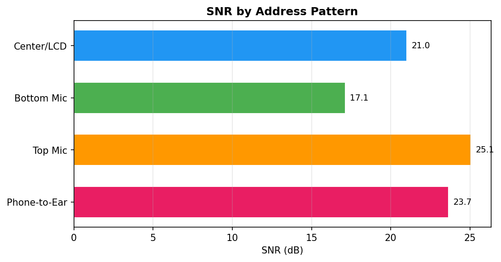
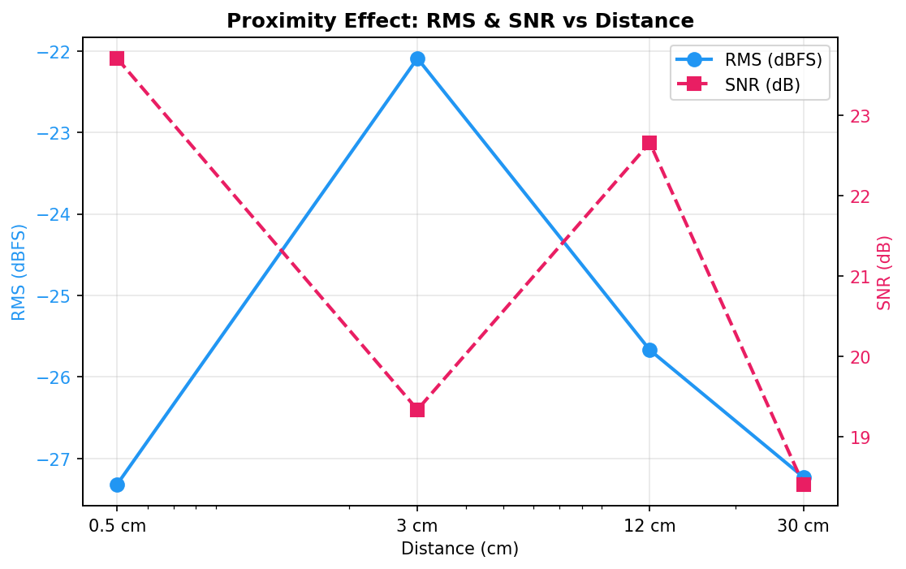
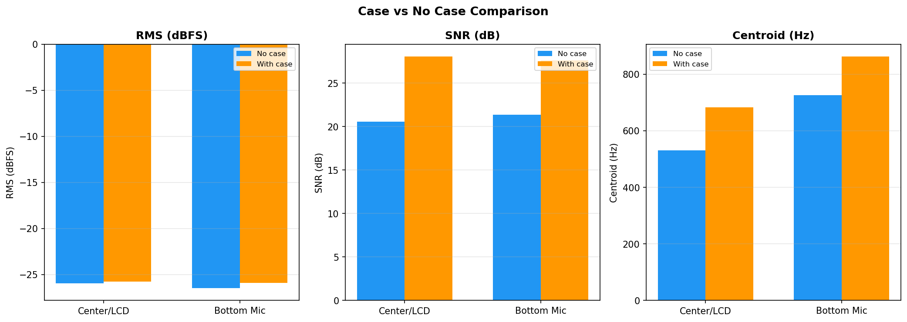
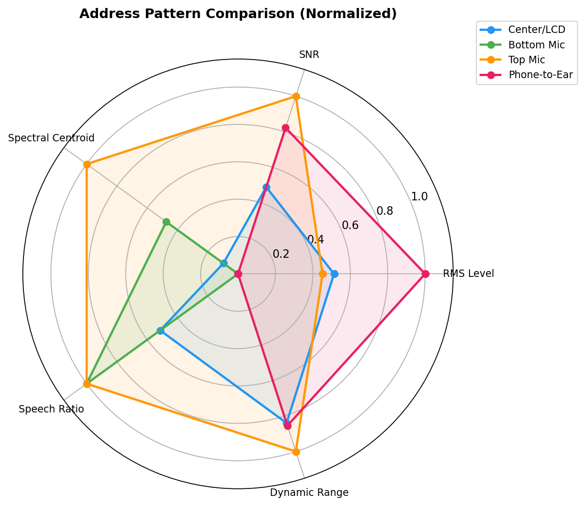
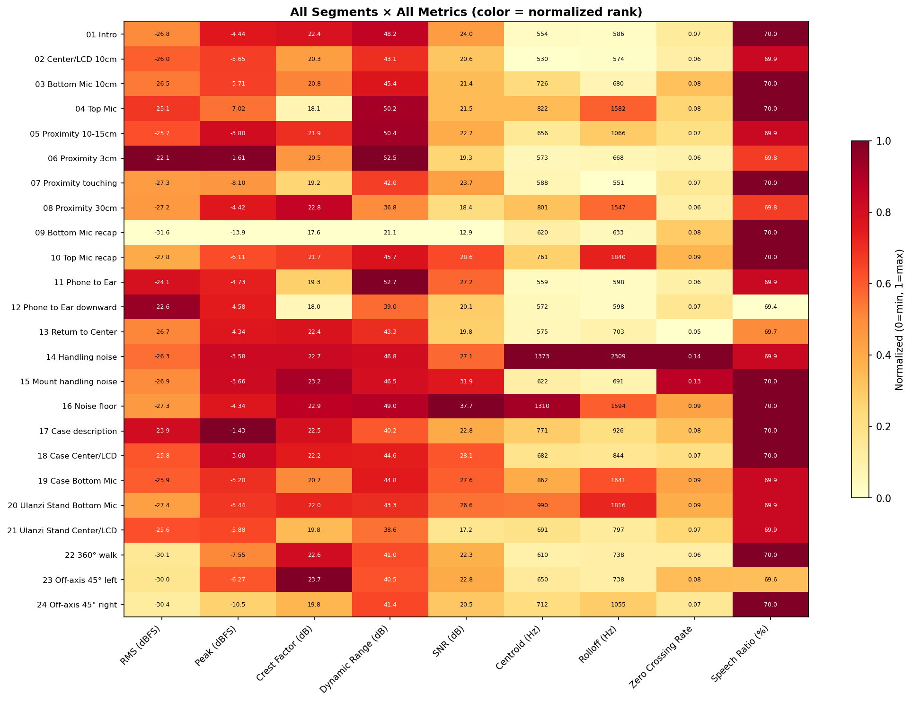

# OnePlus Internal Mic Testing

Systematic testing of how different address patterns, distances, and configurations affect voice recording quality on the **OnePlus Nord 3 5G** (CPH2493) internal microphone.

## TL;DR — How to Get the Best Voice Recording from Your Phone

Based on measured audio analysis (RMS level, SNR, spectral content) across 24 test configurations:

### 1. Speak at the screen, not the mic port

Counter-intuitively, **addressing the center of the LCD screen** produces better balanced audio than speaking directly into the bottom microphone port. The bottom mic (near USB-C) — where most people instinctively aim — actually produced the **worst SNR** (17.1 dB) of all address patterns. Center/LCD gave a cleaner, more natural sound (SNR 21.0 dB, lower spectral centroid = warmer tone).

### 2. Keep 10–15cm distance

The sweet spot is **10–15cm from the screen**. This distance gives strong SNR (22.7 dB) without the bass boost and distortion that comes from being too close. At 30cm, signal drops off noticeably (SNR 18.4 dB). Touching distance has high SNR but is impractical and clips easily.

### 3. Use a stand or mount

Handling noise is the single biggest quality killer for phone recordings. Even a basic phone stand (tested with a Ulanzi selfie stick) **dramatically reduces low-frequency rumble** from hand vibrations. The mount showed good rejection of transferred vibrations too.

### 4. Your case doesn't matter

No measurable difference between cased and uncased recordings (RMS within 0.3 dB, case actually showed slightly higher SNR). As long as your case has mic port cutouts, use it freely.

### 5. Stay on-axis

Moving off-axis (45° or more) drops signal by ~4 dB and shifts spectral content. Face the screen when recording.

## Address Pattern Comparison

| Pattern | RMS (dBFS) | SNR (dB) | Spectral Centroid | Verdict |
|---------|-----------|---------|-------------------|---------|
| Center/LCD screen | -26.1 | 21.0 | 587 Hz | **Best all-rounder** — natural tone, good SNR |
| Bottom mic (USB-C) | -29.0 | 17.1 | 673 Hz | Worst SNR despite being the "obvious" target |
| Top mic (secondary) | -26.5 | 25.1 | 792 Hz | Highest SNR but brighter/thinner sound |
| Phone-to-ear | -23.3 | 23.7 | 565 Hz | Loudest signal but not a practical recording pose |

## Data Visualizations

### SNR by Address Pattern


### Proximity Effect


### Case Comparison


### Full Radar Comparison


### All Segments Heatmap


## Test Methodology

- **Device:** OnePlus Nord 3 5G (CPH2493) — dual microphone, Qualcomm SM7475
- **Recording:** 48kHz stereo WAV via ASR (Android recording app)
- **Processing:** All digital controls disabled (no noise cancellation, no AGC)
- **Analysis:** 9 metrics per segment (RMS, peak, crest factor, dynamic range, SNR, spectral centroid, spectral rolloff, zero crossing rate, speech ratio)
- **Environment:** Untreated room, ambient background noise present

See [device-specs.md](device-specs.md) for full device specifications.

## Media Downloads

| File | Size | Link |
|------|------|------|
| Analysis video (MP4) | 52 MB | [oneplus_mic_test.mp4](https://cdn-2.danielrosehill.com/oneplus-mic-test/oneplus_mic_test.mp4) |
| Full recording (WAV) | 99 MB | [One Plus audio Testing.wav](https://cdn-2.danielrosehill.com/oneplus-mic-test/One%20Plus%20audio%20Testing.wav) |

The video includes real-time stereo field visualization (Lissajous), L/R level meters, segment labels, and subtitles overlaid on the original audio.

To regenerate the video locally:

```bash
python3 generate_video.py
```

## Repository Contents

| File | Description |
|------|-------------|
| `segments/` | 24 individual WAV clips + JSON metadata + analysis charts |
| `segments/SUMMARY.md` | Full analysis report with all metrics and comparisons |
| `segments/analysis.json` | Machine-readable analysis data |
| `segments/summary.csv` | Spreadsheet-friendly metrics export |
| `segments/charts/` | 7 data visualization charts (PNG) |
| `transcription.md` | Timestamped transcription of the full recording |
| `device-specs.md` | OnePlus Nord 3 5G specifications |
| `analyze_segments.py` | Audio analysis and chart generation script |
| `split_segments.py` | Segment splitting script |
| `generate_video.py` | Video generation script (subtitles + stereo viz) |

## Segments

The full recording was split into 24 clips covering different test configurations:

| # | Filename | Duration | Description |
|---|----------|----------|-------------|
| 01 | `01_intro.wav` | 2:25 | Preamble — recording setup and purpose |
| 02 | `02_center_lcd_10cm.wav` | 0:23 | Center/LCD screen address, ~10cm |
| 03 | `03_bottom_mic_10cm.wav` | 0:25 | Bottom microphone (primary, near USB-C), ~10cm |
| 04 | `04_top_mic.wav` | 0:11 | Top microphone (secondary) |
| 05 | `05_proximity_10-15cm.wav` | 0:14 | Proximity test — 10–15cm from screen |
| 06 | `06_proximity_3cm.wav` | 0:07 | Proximity test — ~3cm from screen |
| 07 | `07_proximity_touching.wav` | 0:02 | Proximity test — almost touching screen |
| 08 | `08_proximity_30cm.wav` | 0:10 | Proximity test — ~30cm comfortable distance |
| 09 | `09_bottom_mic_recap.wav` | 0:04 | Address pattern 2 recap — bottom mic |
| 10 | `10_top_mic_recap.wav` | 0:04 | Address pattern 3 recap — top mic |
| 11 | `11_phone_to_ear.wav` | 0:33 | Phone held to ear — speaking away from mic |
| 12 | `12_phone_to_ear_downward.wav` | 0:06 | Phone to ear, voice directed downward |
| 13 | `13_return_to_center.wav` | 0:06 | Return to center address |
| 14 | `14_handling_noise.wav` | 0:24 | Handling noise test — moving phone, pocket |
| 15 | `15_mount_handling_noise.wav` | 0:42 | Phone on mount — transferred handling noise |
| 16 | `16_noise_floor.wav` | 0:25 | Room noise floor profile |
| 17 | `17_case_description.wav` | 0:40 | Describing the phone case before testing |
| 18 | `18_case_center_lcd.wav` | 0:11 | With case — center/LCD address |
| 19 | `19_case_bottom_mic.wav` | 0:13 | With case — bottom mic address |
| 20 | `20_ulanzi_stand_bottom_mic.wav` | 0:21 | On Ulanzi stand — bottom mic address |
| 21 | `21_ulanzi_stand_center_lcd.wav` | 0:14 | On Ulanzi stand — center/LCD address |
| 22 | `22_360_walk.wav` | 0:33 | 360° walk around the phone |
| 23 | `23_off_axis_45_left.wav` | 0:08 | 45° off-axis left |
| 24 | `24_off_axis_45_right.wav` | 0:09 | 45° off-axis right |
